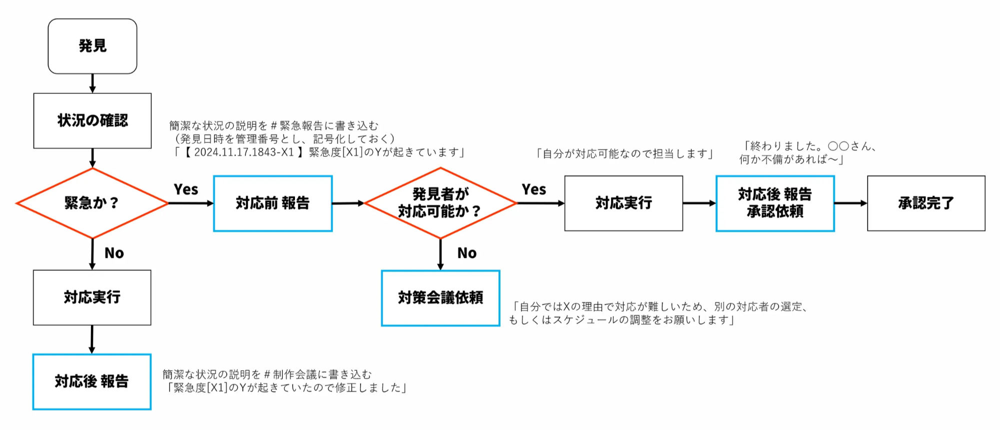

<!-- TOC -->

- [トラブル対応](#%E3%83%88%E3%83%A9%E3%83%96%E3%83%AB%E5%AF%BE%E5%BF%9C)
- [フローチャート（暫定）](#%E3%83%95%E3%83%AD%E3%83%BC%E3%83%81%E3%83%A3%E3%83%BC%E3%83%88%E6%9A%AB%E5%AE%9A)
- [緊急度リスト](#%E7%B7%8A%E6%80%A5%E5%BA%A6%E3%83%AA%E3%82%B9%E3%83%88)
    - [S：幹部全員で検討。会議必須。現在作業中のタスクは緊急一時停止](#s%E5%B9%B9%E9%83%A8%E5%85%A8%E5%93%A1%E3%81%A7%E6%A4%9C%E8%A8%8E%E4%BC%9A%E8%AD%B0%E5%BF%85%E9%A0%88%E7%8F%BE%E5%9C%A8%E4%BD%9C%E6%A5%AD%E4%B8%AD%E3%81%AE%E3%82%BF%E3%82%B9%E3%82%AF%E3%81%AF%E7%B7%8A%E6%80%A5%E4%B8%80%E6%99%82%E5%81%9C%E6%AD%A2)
        - [S-1：著作権の侵害が発覚](#s-1%E8%91%97%E4%BD%9C%E6%A8%A9%E3%81%AE%E4%BE%B5%E5%AE%B3%E3%81%8C%E7%99%BA%E8%A6%9A)
        - [S-2：配信タイトルのガイドライン違反](#s-2%E9%85%8D%E4%BF%A1%E3%82%BF%E3%82%A4%E3%83%88%E3%83%AB%E3%81%AE%E3%82%AC%E3%82%A4%E3%83%89%E3%83%A9%E3%82%A4%E3%83%B3%E9%81%95%E5%8F%8D)
        - [S-3：親族や知人のあらゆる個人情報の漏洩](#s-3%E8%A6%AA%E6%97%8F%E3%82%84%E7%9F%A5%E4%BA%BA%E3%81%AE%E3%81%82%E3%82%89%E3%82%86%E3%82%8B%E5%80%8B%E4%BA%BA%E6%83%85%E5%A0%B1%E3%81%AE%E6%BC%8F%E6%B4%A9)
        - [S-4：配信者が行う、人種や性別、職業、病気、あらゆるマイノリティに対する否定的または嘲笑的な発言](#s-4%E9%85%8D%E4%BF%A1%E8%80%85%E3%81%8C%E8%A1%8C%E3%81%86%E4%BA%BA%E7%A8%AE%E3%82%84%E6%80%A7%E5%88%A5%E8%81%B7%E6%A5%AD%E7%97%85%E6%B0%97%E3%81%82%E3%82%89%E3%82%86%E3%82%8B%E3%83%9E%E3%82%A4%E3%83%8E%E3%83%AA%E3%83%86%E3%82%A3%E3%81%AB%E5%AF%BE%E3%81%99%E3%82%8B%E5%90%A6%E5%AE%9A%E7%9A%84%E3%81%BE%E3%81%9F%E3%81%AF%E5%98%B2%E7%AC%91%E7%9A%84%E3%81%AA%E7%99%BA%E8%A8%80)
        - [S-5：視聴者が残す、人種や性別、職業、病気、あらゆるマイノリティに対する否定的または嘲笑的なメッセージ](#s-5%E8%A6%96%E8%81%B4%E8%80%85%E3%81%8C%E6%AE%8B%E3%81%99%E4%BA%BA%E7%A8%AE%E3%82%84%E6%80%A7%E5%88%A5%E8%81%B7%E6%A5%AD%E7%97%85%E6%B0%97%E3%81%82%E3%82%89%E3%82%86%E3%82%8B%E3%83%9E%E3%82%A4%E3%83%8E%E3%83%AA%E3%83%86%E3%82%A3%E3%81%AB%E5%AF%BE%E3%81%99%E3%82%8B%E5%90%A6%E5%AE%9A%E7%9A%84%E3%81%BE%E3%81%9F%E3%81%AF%E5%98%B2%E7%AC%91%E7%9A%84%E3%81%AA%E3%83%A1%E3%83%83%E3%82%BB%E3%83%BC%E3%82%B8)
        - [S-6：意図しないかたちでサムネイルなどのデザインが酷似してしまい、SNSで比較画像の投稿が起こるなど拡散が進行している](#s-6%E6%84%8F%E5%9B%B3%E3%81%97%E3%81%AA%E3%81%84%E3%81%8B%E3%81%9F%E3%81%A1%E3%81%A7%E3%82%B5%E3%83%A0%E3%83%8D%E3%82%A4%E3%83%AB%E3%81%AA%E3%81%A9%E3%81%AE%E3%83%87%E3%82%B6%E3%82%A4%E3%83%B3%E3%81%8C%E9%85%B7%E4%BC%BC%E3%81%97%E3%81%A6%E3%81%97%E3%81%BE%E3%81%84sns%E3%81%A7%E6%AF%94%E8%BC%83%E7%94%BB%E5%83%8F%E3%81%AE%E6%8A%95%E7%A8%BF%E3%81%8C%E8%B5%B7%E3%81%93%E3%82%8B%E3%81%AA%E3%81%A9%E6%8B%A1%E6%95%A3%E3%81%8C%E9%80%B2%E8%A1%8C%E3%81%97%E3%81%A6%E3%81%84%E3%82%8B)
        - [S-7：公開の有無を問わず、作成者がサムネイルのデザインの意図的な盗用を幹部に隠していた](#s-7%E5%85%AC%E9%96%8B%E3%81%AE%E6%9C%89%E7%84%A1%E3%82%92%E5%95%8F%E3%82%8F%E3%81%9A%E4%BD%9C%E6%88%90%E8%80%85%E3%81%8C%E3%82%B5%E3%83%A0%E3%83%8D%E3%82%A4%E3%83%AB%E3%81%AE%E3%83%87%E3%82%B6%E3%82%A4%E3%83%B3%E3%81%AE%E6%84%8F%E5%9B%B3%E7%9A%84%E3%81%AA%E7%9B%97%E7%94%A8%E3%82%92%E5%B9%B9%E9%83%A8%E3%81%AB%E9%9A%A0%E3%81%97%E3%81%A6%E3%81%84%E3%81%9F)
        - [S-8：チート、スマーフ、リアルマネートレードなど、ゲームにおける一般的な違法行為の実行やそれを容認するアクション](#s-8%E3%83%81%E3%83%BC%E3%83%88%E3%82%B9%E3%83%9E%E3%83%BC%E3%83%95%E3%83%AA%E3%82%A2%E3%83%AB%E3%83%9E%E3%83%8D%E3%83%BC%E3%83%88%E3%83%AC%E3%83%BC%E3%83%89%E3%81%AA%E3%81%A9%E3%82%B2%E3%83%BC%E3%83%A0%E3%81%AB%E3%81%8A%E3%81%91%E3%82%8B%E4%B8%80%E8%88%AC%E7%9A%84%E3%81%AA%E9%81%95%E6%B3%95%E8%A1%8C%E7%82%BA%E3%81%AE%E5%AE%9F%E8%A1%8C%E3%82%84%E3%81%9D%E3%82%8C%E3%82%92%E5%AE%B9%E8%AA%8D%E3%81%99%E3%82%8B%E3%82%A2%E3%82%AF%E3%82%B7%E3%83%A7%E3%83%B3)
        - [S-9：配信者が行う、特定の企業や組織、製品を貶める発言や、嘲笑的と受け取られそうな発言](#s-9%E9%85%8D%E4%BF%A1%E8%80%85%E3%81%8C%E8%A1%8C%E3%81%86%E7%89%B9%E5%AE%9A%E3%81%AE%E4%BC%81%E6%A5%AD%E3%82%84%E7%B5%84%E7%B9%94%E8%A3%BD%E5%93%81%E3%82%92%E8%B2%B6%E3%82%81%E3%82%8B%E7%99%BA%E8%A8%80%E3%82%84%E5%98%B2%E7%AC%91%E7%9A%84%E3%81%A8%E5%8F%97%E3%81%91%E5%8F%96%E3%82%89%E3%82%8C%E3%81%9D%E3%81%86%E3%81%AA%E7%99%BA%E8%A8%80)
        - [S-10：アカウントの乗っ取り](#s-10%E3%82%A2%E3%82%AB%E3%82%A6%E3%83%B3%E3%83%88%E3%81%AE%E4%B9%97%E3%81%A3%E5%8F%96%E3%82%8A)
    - [A：幹部複数人で検討。会議必須](#a%E5%B9%B9%E9%83%A8%E8%A4%87%E6%95%B0%E4%BA%BA%E3%81%A7%E6%A4%9C%E8%A8%8E%E4%BC%9A%E8%AD%B0%E5%BF%85%E9%A0%88)
        - [A-1：配信者当人の本名以外、住所や電話番号などの情報漏洩（当人の希望によっては本名も含まれる）](#a-1%E9%85%8D%E4%BF%A1%E8%80%85%E5%BD%93%E4%BA%BA%E3%81%AE%E6%9C%AC%E5%90%8D%E4%BB%A5%E5%A4%96%E4%BD%8F%E6%89%80%E3%82%84%E9%9B%BB%E8%A9%B1%E7%95%AA%E5%8F%B7%E3%81%AA%E3%81%A9%E3%81%AE%E6%83%85%E5%A0%B1%E6%BC%8F%E6%B4%A9%E5%BD%93%E4%BA%BA%E3%81%AE%E5%B8%8C%E6%9C%9B%E3%81%AB%E3%82%88%E3%81%A3%E3%81%A6%E3%81%AF%E6%9C%AC%E5%90%8D%E3%82%82%E5%90%AB%E3%81%BE%E3%82%8C%E3%82%8B)
        - [A-2：公開済みの動画の、YouTube上からの誤った削除](#a-2%E5%85%AC%E9%96%8B%E6%B8%88%E3%81%BF%E3%81%AE%E5%8B%95%E7%94%BB%E3%81%AEyoutube%E4%B8%8A%E3%81%8B%E3%82%89%E3%81%AE%E8%AA%A4%E3%81%A3%E3%81%9F%E5%89%8A%E9%99%A4)
        - [A-3：意図しないかたちでサムネイルなどのデザインが酷似してしまったが、動画のコメント欄での指摘などYouTube以外にまだ拡散していない状態で収まっている](#a-3%E6%84%8F%E5%9B%B3%E3%81%97%E3%81%AA%E3%81%84%E3%81%8B%E3%81%9F%E3%81%A1%E3%81%A7%E3%82%B5%E3%83%A0%E3%83%8D%E3%82%A4%E3%83%AB%E3%81%AA%E3%81%A9%E3%81%AE%E3%83%87%E3%82%B6%E3%82%A4%E3%83%B3%E3%81%8C%E9%85%B7%E4%BC%BC%E3%81%97%E3%81%A6%E3%81%97%E3%81%BE%E3%81%A3%E3%81%9F%E3%81%8C%E5%8B%95%E7%94%BB%E3%81%AE%E3%82%B3%E3%83%A1%E3%83%B3%E3%83%88%E6%AC%84%E3%81%A7%E3%81%AE%E6%8C%87%E6%91%98%E3%81%AA%E3%81%A9youtube%E4%BB%A5%E5%A4%96%E3%81%AB%E3%81%BE%E3%81%A0%E6%8B%A1%E6%95%A3%E3%81%97%E3%81%A6%E3%81%84%E3%81%AA%E3%81%84%E7%8A%B6%E6%85%8B%E3%81%A7%E5%8F%8E%E3%81%BE%E3%81%A3%E3%81%A6%E3%81%84%E3%82%8B)
        - [A-4：オマージュやミームのつもりだったが攻めすぎて公式からお叱りを受けた](#a-4%E3%82%AA%E3%83%9E%E3%83%BC%E3%82%B8%E3%83%A5%E3%82%84%E3%83%9F%E3%83%BC%E3%83%A0%E3%81%AE%E3%81%A4%E3%82%82%E3%82%8A%E3%81%A0%E3%81%A3%E3%81%9F%E3%81%8C%E6%94%BB%E3%82%81%E3%81%99%E3%81%8E%E3%81%A6%E5%85%AC%E5%BC%8F%E3%81%8B%E3%82%89%E3%81%8A%E5%8F%B1%E3%82%8A%E3%82%92%E5%8F%97%E3%81%91%E3%81%9F)
        - [A-5：気に入らない視聴者に対し、サブアカウントや知人などを利用して攻撃的なアプローチをとった](#a-5%E6%B0%97%E3%81%AB%E5%85%A5%E3%82%89%E3%81%AA%E3%81%84%E8%A6%96%E8%81%B4%E8%80%85%E3%81%AB%E5%AF%BE%E3%81%97%E3%82%B5%E3%83%96%E3%82%A2%E3%82%AB%E3%82%A6%E3%83%B3%E3%83%88%E3%82%84%E7%9F%A5%E4%BA%BA%E3%81%AA%E3%81%A9%E3%82%92%E5%88%A9%E7%94%A8%E3%81%97%E3%81%A6%E6%94%BB%E6%92%83%E7%9A%84%E3%81%AA%E3%82%A2%E3%83%97%E3%83%AD%E3%83%BC%E3%83%81%E3%82%92%E3%81%A8%E3%81%A3%E3%81%9F)
        - [A-6：知人が、気に入らない共同配信者または視聴者に対し、何らかの手段を用いて攻撃的なアプローチをとった](#a-6%E7%9F%A5%E4%BA%BA%E3%81%8C%E6%B0%97%E3%81%AB%E5%85%A5%E3%82%89%E3%81%AA%E3%81%84%E5%85%B1%E5%90%8C%E9%85%8D%E4%BF%A1%E8%80%85%E3%81%BE%E3%81%9F%E3%81%AF%E8%A6%96%E8%81%B4%E8%80%85%E3%81%AB%E5%AF%BE%E3%81%97%E4%BD%95%E3%82%89%E3%81%8B%E3%81%AE%E6%89%8B%E6%AE%B5%E3%82%92%E7%94%A8%E3%81%84%E3%81%A6%E6%94%BB%E6%92%83%E7%9A%84%E3%81%AA%E3%82%A2%E3%83%97%E3%83%AD%E3%83%BC%E3%83%81%E3%82%92%E3%81%A8%E3%81%A3%E3%81%9F)
        - [A-7：ライブ配信、収録、プライベートを問わず、イラつきから物を叩く、ゲームを放棄する、死体撃ちなどの粗暴な行動が確認された](#a-7%E3%83%A9%E3%82%A4%E3%83%96%E9%85%8D%E4%BF%A1%E5%8F%8E%E9%8C%B2%E3%83%97%E3%83%A9%E3%82%A4%E3%83%99%E3%83%BC%E3%83%88%E3%82%92%E5%95%8F%E3%82%8F%E3%81%9A%E3%82%A4%E3%83%A9%E3%81%A4%E3%81%8D%E3%81%8B%E3%82%89%E7%89%A9%E3%82%92%E5%8F%A9%E3%81%8F%E3%82%B2%E3%83%BC%E3%83%A0%E3%82%92%E6%94%BE%E6%A3%84%E3%81%99%E3%82%8B%E6%AD%BB%E4%BD%93%E6%92%83%E3%81%A1%E3%81%AA%E3%81%A9%E3%81%AE%E7%B2%97%E6%9A%B4%E3%81%AA%E8%A1%8C%E5%8B%95%E3%81%8C%E7%A2%BA%E8%AA%8D%E3%81%95%E3%82%8C%E3%81%9F)
        - [A-8：共同配信者やゲーム中の登場人物に対するイジメ、ハラスメントを視聴者に感じさせる発言や行動など](#a-8%E5%85%B1%E5%90%8C%E9%85%8D%E4%BF%A1%E8%80%85%E3%82%84%E3%82%B2%E3%83%BC%E3%83%A0%E4%B8%AD%E3%81%AE%E7%99%BB%E5%A0%B4%E4%BA%BA%E7%89%A9%E3%81%AB%E5%AF%BE%E3%81%99%E3%82%8B%E3%82%A4%E3%82%B8%E3%83%A1%E3%83%8F%E3%83%A9%E3%82%B9%E3%83%A1%E3%83%B3%E3%83%88%E3%82%92%E8%A6%96%E8%81%B4%E8%80%85%E3%81%AB%E6%84%9F%E3%81%98%E3%81%95%E3%81%9B%E3%82%8B%E7%99%BA%E8%A8%80%E3%82%84%E8%A1%8C%E5%8B%95%E3%81%AA%E3%81%A9)
    - [B：幹部1名以上（発見者を除く）で検討。場合によって会議](#b%E5%B9%B9%E9%83%A81%E5%90%8D%E4%BB%A5%E4%B8%8A%E7%99%BA%E8%A6%8B%E8%80%85%E3%82%92%E9%99%A4%E3%81%8F%E3%81%A7%E6%A4%9C%E8%A8%8E%E5%A0%B4%E5%90%88%E3%81%AB%E3%82%88%E3%81%A3%E3%81%A6%E4%BC%9A%E8%AD%B0)
        - [B-1：公開する予定の無い、共有用の動画などが公開されている](#b-1%E5%85%AC%E9%96%8B%E3%81%99%E3%82%8B%E4%BA%88%E5%AE%9A%E3%81%AE%E7%84%A1%E3%81%84%E5%85%B1%E6%9C%89%E7%94%A8%E3%81%AE%E5%8B%95%E7%94%BB%E3%81%AA%E3%81%A9%E3%81%8C%E5%85%AC%E9%96%8B%E3%81%95%E3%82%8C%E3%81%A6%E3%81%84%E3%82%8B)
        - [B-2：公開している動画内における、Sランクには該当しないタイプの失言や反応の見落とし、修正ミス](#b-2%E5%85%AC%E9%96%8B%E3%81%97%E3%81%A6%E3%81%84%E3%82%8B%E5%8B%95%E7%94%BB%E5%86%85%E3%81%AB%E3%81%8A%E3%81%91%E3%82%8Bs%E3%83%A9%E3%83%B3%E3%82%AF%E3%81%AB%E3%81%AF%E8%A9%B2%E5%BD%93%E3%81%97%E3%81%AA%E3%81%84%E3%82%BF%E3%82%A4%E3%83%97%E3%81%AE%E5%A4%B1%E8%A8%80%E3%82%84%E5%8F%8D%E5%BF%9C%E3%81%AE%E8%A6%8B%E8%90%BD%E3%81%A8%E3%81%97%E4%BF%AE%E6%AD%A3%E3%83%9F%E3%82%B9)
        - [B-3：映像や音声の欠落または色異常、ノイズ、爆音など視聴者にとって不快な現象の見落とし、編集ミス](#b-3%E6%98%A0%E5%83%8F%E3%82%84%E9%9F%B3%E5%A3%B0%E3%81%AE%E6%AC%A0%E8%90%BD%E3%81%BE%E3%81%9F%E3%81%AF%E8%89%B2%E7%95%B0%E5%B8%B8%E3%83%8E%E3%82%A4%E3%82%BA%E7%88%86%E9%9F%B3%E3%81%AA%E3%81%A9%E8%A6%96%E8%81%B4%E8%80%85%E3%81%AB%E3%81%A8%E3%81%A3%E3%81%A6%E4%B8%8D%E5%BF%AB%E3%81%AA%E7%8F%BE%E8%B1%A1%E3%81%AE%E8%A6%8B%E8%90%BD%E3%81%A8%E3%81%97%E7%B7%A8%E9%9B%86%E3%83%9F%E3%82%B9)
        - [B-4：ゲームタイトルの誤り](#b-4%E3%82%B2%E3%83%BC%E3%83%A0%E3%82%BF%E3%82%A4%E3%83%88%E3%83%AB%E3%81%AE%E8%AA%A4%E3%82%8A)
        - [B-5：動画名やサムネイルにおける強いネタバレ要素の見落とし](#b-5%E5%8B%95%E7%94%BB%E5%90%8D%E3%82%84%E3%82%B5%E3%83%A0%E3%83%8D%E3%82%A4%E3%83%AB%E3%81%AB%E3%81%8A%E3%81%91%E3%82%8B%E5%BC%B7%E3%81%84%E3%83%8D%E3%82%BF%E3%83%90%E3%83%AC%E8%A6%81%E7%B4%A0%E3%81%AE%E8%A6%8B%E8%90%BD%E3%81%A8%E3%81%97)
        - [B-6：ライブ配信か収録のどちらかで、イラつきから暴言や皮肉を言う、連続した無視などの陰湿な行動が確認された](#b-6%E3%83%A9%E3%82%A4%E3%83%96%E9%85%8D%E4%BF%A1%E3%81%8B%E5%8F%8E%E9%8C%B2%E3%81%AE%E3%81%A9%E3%81%A1%E3%82%89%E3%81%8B%E3%81%A7%E3%82%A4%E3%83%A9%E3%81%A4%E3%81%8D%E3%81%8B%E3%82%89%E6%9A%B4%E8%A8%80%E3%82%84%E7%9A%AE%E8%82%89%E3%82%92%E8%A8%80%E3%81%86%E9%80%A3%E7%B6%9A%E3%81%97%E3%81%9F%E7%84%A1%E8%A6%96%E3%81%AA%E3%81%A9%E3%81%AE%E9%99%B0%E6%B9%BF%E3%81%AA%E8%A1%8C%E5%8B%95%E3%81%8C%E7%A2%BA%E8%AA%8D%E3%81%95%E3%82%8C%E3%81%9F)
    - [C：緊急だが個人で検討。対応前報告を前提とし、対応実行を許可](#c%E7%B7%8A%E6%80%A5%E3%81%A0%E3%81%8C%E5%80%8B%E4%BA%BA%E3%81%A7%E6%A4%9C%E8%A8%8E%E5%AF%BE%E5%BF%9C%E5%89%8D%E5%A0%B1%E5%91%8A%E3%82%92%E5%89%8D%E6%8F%90%E3%81%A8%E3%81%97%E5%AF%BE%E5%BF%9C%E5%AE%9F%E8%A1%8C%E3%82%92%E8%A8%B1%E5%8F%AF)
        - [C-1：再生リストの順番の誤り](#c-1%E5%86%8D%E7%94%9F%E3%83%AA%E3%82%B9%E3%83%88%E3%81%AE%E9%A0%86%E7%95%AA%E3%81%AE%E8%AA%A4%E3%82%8A)
        - [C-2：動画ナンバーの誤り](#c-2%E5%8B%95%E7%94%BB%E3%83%8A%E3%83%B3%E3%83%90%E3%83%BC%E3%81%AE%E8%AA%A4%E3%82%8A)
        - [C-3：視聴者によるコメントの連投、業者によるコメント](#c-3%E8%A6%96%E8%81%B4%E8%80%85%E3%81%AB%E3%82%88%E3%82%8B%E3%82%B3%E3%83%A1%E3%83%B3%E3%83%88%E3%81%AE%E9%80%A3%E6%8A%95%E6%A5%AD%E8%80%85%E3%81%AB%E3%82%88%E3%82%8B%E3%82%B3%E3%83%A1%E3%83%B3%E3%83%88)
        - [C-4：視聴者へ向けて告知してしまった動画公開時間などの不履行](#c-4%E8%A6%96%E8%81%B4%E8%80%85%E3%81%B8%E5%90%91%E3%81%91%E3%81%A6%E5%91%8A%E7%9F%A5%E3%81%97%E3%81%A6%E3%81%97%E3%81%BE%E3%81%A3%E3%81%9F%E5%8B%95%E7%94%BB%E5%85%AC%E9%96%8B%E6%99%82%E9%96%93%E3%81%AA%E3%81%A9%E3%81%AE%E4%B8%8D%E5%B1%A5%E8%A1%8C)
    - [D：場合によって緊急として対応](#d%E5%A0%B4%E5%90%88%E3%81%AB%E3%82%88%E3%81%A3%E3%81%A6%E7%B7%8A%E6%80%A5%E3%81%A8%E3%81%97%E3%81%A6%E5%AF%BE%E5%BF%9C)
        - [D-1：サムネイルの設定ミス](#d-1%E3%82%B5%E3%83%A0%E3%83%8D%E3%82%A4%E3%83%AB%E3%81%AE%E8%A8%AD%E5%AE%9A%E3%83%9F%E3%82%B9)
        - [D-2：公式Xや再生リストなどのリンクのミス](#d-2%E5%85%AC%E5%BC%8Fx%E3%82%84%E5%86%8D%E7%94%9F%E3%83%AA%E3%82%B9%E3%83%88%E3%81%AA%E3%81%A9%E3%81%AE%E3%83%AA%E3%83%B3%E3%82%AF%E3%81%AE%E3%83%9F%E3%82%B9)
        - [D-3：視聴者による、配信者の発言内容の誤りを指摘するコメント](#d-3%E8%A6%96%E8%81%B4%E8%80%85%E3%81%AB%E3%82%88%E3%82%8B%E9%85%8D%E4%BF%A1%E8%80%85%E3%81%AE%E7%99%BA%E8%A8%80%E5%86%85%E5%AE%B9%E3%81%AE%E8%AA%A4%E3%82%8A%E3%82%92%E6%8C%87%E6%91%98%E3%81%99%E3%82%8B%E3%82%B3%E3%83%A1%E3%83%B3%E3%83%88)
        - [D-4：ブラウザ側の仕様によって、サムネイルに意図せぬ劣化やズレが生じている](#d-4%E3%83%96%E3%83%A9%E3%82%A6%E3%82%B6%E5%81%B4%E3%81%AE%E4%BB%95%E6%A7%98%E3%81%AB%E3%82%88%E3%81%A3%E3%81%A6%E3%82%B5%E3%83%A0%E3%83%8D%E3%82%A4%E3%83%AB%E3%81%AB%E6%84%8F%E5%9B%B3%E3%81%9B%E3%81%AC%E5%8A%A3%E5%8C%96%E3%82%84%E3%82%BA%E3%83%AC%E3%81%8C%E7%94%9F%E3%81%98%E3%81%A6%E3%81%84%E3%82%8B)
    - [E：対応後 報告](#e%E5%AF%BE%E5%BF%9C%E5%BE%8C-%E5%A0%B1%E5%91%8A)
        - [E-1：動画タイトルや概要欄における、ゲームタイトルや動画ナンバー以外の文字の誤字脱字](#e-1%E5%8B%95%E7%94%BB%E3%82%BF%E3%82%A4%E3%83%88%E3%83%AB%E3%82%84%E6%A6%82%E8%A6%81%E6%AC%84%E3%81%AB%E3%81%8A%E3%81%91%E3%82%8B%E3%82%B2%E3%83%BC%E3%83%A0%E3%82%BF%E3%82%A4%E3%83%88%E3%83%AB%E3%82%84%E5%8B%95%E7%94%BB%E3%83%8A%E3%83%B3%E3%83%90%E3%83%BC%E4%BB%A5%E5%A4%96%E3%81%AE%E6%96%87%E5%AD%97%E3%81%AE%E8%AA%A4%E5%AD%97%E8%84%B1%E5%AD%97)

<!-- /TOC -->
        - [D-3：視聴者による、配信者の発言内容の誤りを指摘するコメント](#d-3%E8%A6%96%E8%81%B4%E8%80%85%E3%81%AB%E3%82%88%E3%82%8B%E9%85%8D%E4%BF%A1%E8%80%85%E3%81%AE%E7%99%BA%E8%A8%80%E5%86%85%E5%AE%B9%E3%81%AE%E8%AA%A4%E3%82%8A%E3%82%92%E6%8C%87%E6%91%98%E3%81%99%E3%82%8B%E3%82%B3%E3%83%A1%E3%83%B3%E3%83%88)
        - [D-4：ブラウザ側の仕様によって、サムネイルに意図せぬ劣化やズレが生じている](#d-4%E3%83%96%E3%83%A9%E3%82%A6%E3%82%B6%E5%81%B4%E3%81%AE%E4%BB%95%E6%A7%98%E3%81%AB%E3%82%88%E3%81%A3%E3%81%A6%E3%82%B5%E3%83%A0%E3%83%8D%E3%82%A4%E3%83%AB%E3%81%AB%E6%84%8F%E5%9B%B3%E3%81%9B%E3%81%AC%E5%8A%A3%E5%8C%96%E3%82%84%E3%82%BA%E3%83%AC%E3%81%8C%E7%94%9F%E3%81%98%E3%81%A6%E3%81%84%E3%82%8B)
    - [E：対応後 報告](#e%E5%AF%BE%E5%BF%9C%E5%BE%8C-%E5%A0%B1%E5%91%8A)
        - [E-1：動画タイトルや概要欄における、ゲームタイトルや動画ナンバー以外の文字の誤字脱字](#e-1%E5%8B%95%E7%94%BB%E3%82%BF%E3%82%A4%E3%83%88%E3%83%AB%E3%82%84%E6%A6%82%E8%A6%81%E6%AC%84%E3%81%AB%E3%81%8A%E3%81%91%E3%82%8B%E3%82%B2%E3%83%BC%E3%83%A0%E3%82%BF%E3%82%A4%E3%83%88%E3%83%AB%E3%82%84%E5%8B%95%E7%94%BB%E3%83%8A%E3%83%B3%E3%83%90%E3%83%BC%E4%BB%A5%E5%A4%96%E3%81%AE%E6%96%87%E5%AD%97%E3%81%AE%E8%AA%A4%E5%AD%97%E8%84%B1%E5%AD%97)

<!-- /TOC -->
# トラブル対応


# 1.フローチャート（暫定）


# 2.緊急度リスト

## S：幹部全員で検討。会議必須。現在作業中のタスクは緊急一時停止
Sランクは「やこうせいアライヴ」の存続そのものだけでなく、各々の人生全体に致命的な悪影響を及ぼす可能性のある問題が該当。緊急性が高く速やかに対応しなければいけないが、全員の連帯責任で慎重な決断を行う必要あり

### S-1：著作権の侵害が発覚
```
＜事案例＞
プライベートなゲームプレイでのみ流すことが許諾されたゲーム内の楽曲を配信に乗せてしまった、など。
```
```
＜対応＞
幹部が事実確認をしたのち、侵害の確定もしくはその可能性が高いと判断した場合はすみやかに動画を非公開に設定する。その後、YouTubeのオフィシャルの「コミュニティ」とXアカウントの双方で「調査中」の旨を視聴者に告知する。この時点で謝罪は行うように。ただし、侵害を認める謝罪ではなく、一旦の非公開化を謝罪するように。その後、落ち着いて再会議し、対応を考え、実行する。全てが片付いたら、再びYouTubeの「コミュニティ」とXアカウントのほうに顛末を説明し、認めて謝罪するべきところは謝罪する。今回の原因となった部分の明示も忘れずに。万が一、違反性が無かったとしても著作権を尊重して引き続き活動していく旨を記載するように。
```
```
＜事前の防止策＞
楽曲に関してはオプション設定のところに「著作権の楽曲をオフにする」という項目が用意されていることが多い。無い場合はあらかじめBGMのボリュームを0にしてプレイする。その場合、第1回の冒頭でBGMを消している理由をリスク回避として説明するように
```

### S-2：配信タイトルのガイドライン違反
```
＜事案例＞
```
```
＜対応＞
```
```
＜事前の防止策＞
```

### S-3：親族や知人のあらゆる個人情報の漏洩
```
＜事案例＞
```
```
＜対応＞
```
```
＜事前の防止策＞
```
### S-4：配信者が行う、人種や性別、職業、病気、あらゆるマイノリティに対する否定的または嘲笑的な発言
```
＜事案例＞
```
```
＜対応＞
```
```
＜事前の防止策＞
```
### S-5：視聴者が残す、人種や性別、職業、病気、あらゆるマイノリティに対する否定的または嘲笑的なメッセージ
### S-6：意図しないかたちでサムネイルなどのデザインが酷似してしまい、SNSで比較画像の投稿が起こるなど拡散が進行している
### S-7：公開の有無を問わず、作成者がサムネイルのデザインの意図的な盗用を幹部に隠していた
### S-8：チート、スマーフ、リアルマネートレードなど、ゲームにおける一般的な違法行為の実行やそれを容認するアクション
### S-9：配信者が行う、特定の企業や組織、製品を貶める発言や、嘲笑的と受け取られそうな発言
### S-10：アカウントの乗っ取り

## A：幹部複数人で検討。会議必須
### A-1：配信者当人の本名以外、住所や電話番号などの情報漏洩（当人の希望によっては本名も含まれる）
### A-2：公開済みの動画の、YouTube上からの誤った削除
### A-3：意図しないかたちでサムネイルなどのデザインが酷似してしまったが、動画のコメント欄での指摘などYouTube以外にまだ拡散していない状態で収まっている
### A-4：オマージュやミームのつもりだったが攻めすぎて公式からお叱りを受けた
### A-5：気に入らない視聴者に対し、サブアカウントや知人などを利用して攻撃的なアプローチをとった
### A-6：知人が、気に入らない共同配信者または視聴者に対し、何らかの手段を用いて攻撃的なアプローチをとった
### A-7：ライブ配信、収録、プライベートを問わず、イラつきから物を叩く、ゲームを放棄する、死体撃ちなどの粗暴な行動が確認された
### A-8：共同配信者やゲーム中の登場人物に対するイジメ、ハラスメントを視聴者に感じさせる発言や行動など

## B：幹部1名以上（発見者を除く）で検討。場合によって会議
### B-1：公開する予定の無い、共有用の動画などが公開されている
### B-2：公開している動画内における、Sランクには該当しないタイプの失言や反応の見落とし、修正ミス
### B-3：映像や音声の欠落または色異常、ノイズ、爆音など視聴者にとって不快な現象の見落とし、編集ミス
### B-4：ゲームタイトルの誤り
### B-5：動画名やサムネイルにおける強いネタバレ要素の見落とし
### B-6：ライブ配信か収録のどちらかで、イラつきから暴言や皮肉を言う、連続した無視などの陰湿な行動が確認された

## C：緊急だが個人で検討。対応前報告を前提とし、対応実行を許可
### C-1：再生リストの順番の誤り
### C-2：動画ナンバーの誤り
### C-3：視聴者によるコメントの連投、業者によるコメント
### C-4：視聴者へ向けて告知してしまった動画公開時間などの不履行

## D：場合によって緊急として対応
### D-1：サムネイルの設定ミス
### D-2：公式Xや再生リストなどのリンクのミス
### D-3：視聴者による、配信者の発言内容の誤りを指摘するコメント
### D-4：ブラウザ側の仕様によって、サムネイルに意図せぬ劣化やズレが生じている


## E：対応後 報告
### E-1：動画タイトルや概要欄における、ゲームタイトルや動画ナンバー以外の文字の誤字脱字
